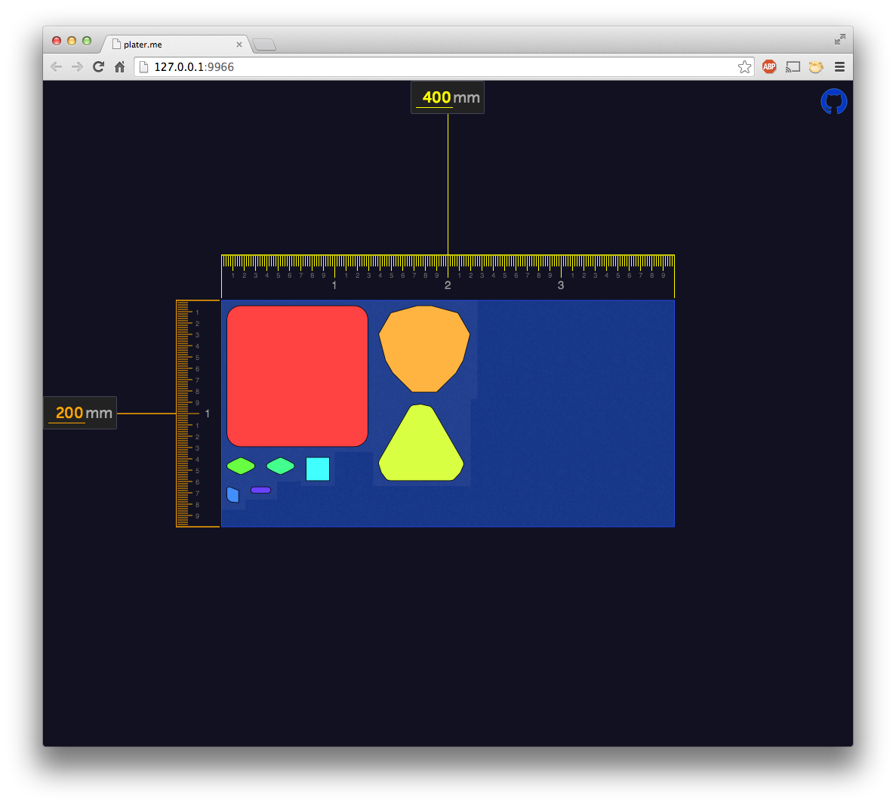

# stlplater

drag and drop stls to be plated for 3d printing



# install

```
git clone git://github.com/tmpvar/stlplater.git
cd stlplater
npm install
```

# use

`npm start` starts a beefy server and launches a browser

Once there, start dragging .stl files on the page and it will compute if/where the stl can fit on the plate

pressing `control|alt|meta + s` will download a file (`stlplater.stl`) which includes all of the models that fit.


# todo

 * spinner while processing stl
 * label stls
 * allow removal of stls
 * show parts that do not fit on the plater
 * allow pan+zoom
 * add webgl view to re-orient the stl (e.g. choose a different axis as the mesh bottom)

# license

[MIT](LICENSE.txt)
